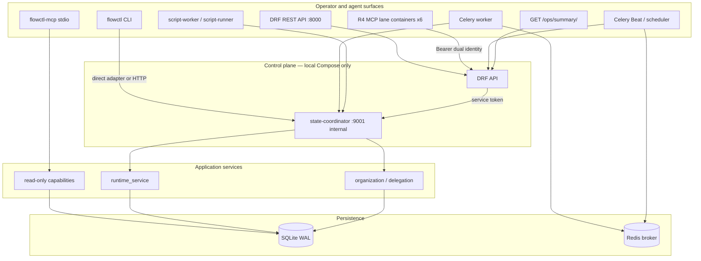

# Architecture and execution paths

**Audience:** contributors implementing features or tracing a request end to end.

**Scope:** describes behavior present in this branch's source tree. Passing
`pytest` or local acceptance scripts does **not** assert production readiness.

**Source anchors:** `src/flow_engine/coordinator/`, `src/flow_engine/control_plane/`,
`src/flow_engine/workers/`, `src/flow_engine/mcp_lanes/`, `docker-compose.yml`.

---

## Layer map (R1 → R4)

| Layer | Doc | Runtime today |
|-------|-----|---------------|
| R1 | [`r1-assets.md`](../r1-assets.md) | Inert catalogs under `agentic/catalogs/` |
| R2 | [`r2-runtime.md`](../r2-runtime.md) | Coordinator + `flowctl runtime` |
| R3 | [`r3-organization.md`](../r3-organization.md) | `flowctl org` / `flowctl delegation` |
| R4 | [`r4-control-plane.md`](../r4-control-plane.md) | DRF, Compose, MCP lanes, scripts, schedules |

Higher layers assume lower-layer invariants: sole SQLite writer, fail-closed
authz, no silent gate bypass.

---

## End-to-end execution diagram



Compact ASCII variant (from `docs/architecture.md`):

```
CLI / flowctl-mcp
        │
        ▼
DRF API ──HTTP──► state-coordinator (sole SQLite writer)
Celery worker ──HTTP──► state-coordinator
        │
        ▼
Application services (runtime, org, delegation, capabilities)
        │
        ▼
SQLite (WAL)          Redis (broker only)
```

---

## Sole-writer rule and trust boundaries

| Boundary | Rule | Enforcement |
|----------|------|-------------|
| SQLite writes | **Only** `StateCoordinator.accept` | `coordinator/coordinator.py`; API opens read paths only |
| DRF API | Never opens SQLite for writes | `control_plane/coordinator_client.py` |
| MCP lane containers | Call DRF only; no `FLOW_DB_PATH`, coordinator URL, or provider CLI | `mcp_lanes/drf_client.py`, Compose service defs |
| script-runner | `network_mode: none`; no DB/Redis credentials | `docker-compose.yml`, `script_sandbox/runner.py` |
| Provider I/O | Outside SQLite transaction after durable intent | `application/worker_delivery.py`, `providers/host_runner.py` |
| Coordinator port | **9001 unpublished** — backend network only | Compose network config |

Coordinator HTTP service: `coordinator/http_service.py`.
CLI adapter: `coordinator/coordinator.py` + `cli/runtime_cmds.py`.

---

## Request path: REST mutation

1. Client presents `Authorization: Bearer <token>` or `X-Orchestrator-Token`
   (`control_plane/api/authentication.py`).
2. DRF resolves principal via coordinator command `control_plane.resolve_token`.
3. View permission class checks surface + `authz_matrix` command allowlist
   (`control_plane/api/permissions.py`).
4. View calls `submit_command` → coordinator HTTP `accept`.
5. Coordinator executes application service inside a SQLite transaction.
6. Envelope returned to client (`control_plane/errors.py` maps to HTTP status).

Anonymous REST allowlist (no bearer required):

| Path | Behavior |
|------|----------|
| `GET /health/` | Liveness + coordinator reachability |
| `POST /api/v1/auth/login` | Password login |
| `POST /api/v1/auth/refresh` | Refresh rotation |
| `POST /api/v1/auth/logout` | Session revoke (token in body) |
| `POST /api/v1/auth/register` | **403** unless `ORCH_ALLOW_USER_REGISTRATION=1`; founder bearer can register under founder authority |

`GET /api/schema/` and `GET /api/docs/` require bearer authentication
(`SPECTACULAR_SETTINGS["SERVE_PERMISSIONS"]` = `IsAuthenticated`; anonymous
**401/403**). Swagger UI HTML requires Django `TEMPLATES` APP_DIRS (configured in
`control_plane/settings.py`). Authenticated principals receive **200** on schema and
rendered docs (`test_openapi_docs_authenticated_html`). Only `GET /health/` and the
explicit auth endpoints are anonymously reachable on the DRF surface.

All other `/api/v1/*` routes require authentication except the explicitly listed
AllowAny auth endpoints above; `POST /api/v1/auth/register` remains
capability-gated as described. `GET /ops/summary/` requires authentication **and**
founder role or `ops.read` capability (`RequireOpsReadOrFounder`).

---

## Request path: worker delivery

1. Celery task receives delivery job (`workers/tasks.py`, `workers/dispatch.py`).
2. Worker opens coordinator HTTP with `ORCH_WORKER_SERVICE_TOKEN`
   (`X-Orchestrator-Service-Token`, `service_kind=worker`).
3. Delivery commands also pass principal bearer `ORCH_TOKEN_WORKER` or
   `ORCH_TOKEN_WORKER_<PROVIDER>` as `X-Orchestrator-Principal-Token` where
   required (`workers/tasks.py`).
4. Commands: `delivery.claim`, `runtime.worker_deliver`, heartbeats, results,
   credit settle (`authz_matrix.py` worker allowlist).
5. Mock provider obeys host-runner protocol in test mode; real bindings use
   `providers/host_runner.py` when `ORCH_PROVIDER_MODE` permits (local acceptance only).

---

## Request path: MCP lane invoke

1. Lane container receives tool call with initiating principal bearer + MCP service token.
2. Lane calls DRF `POST /api/v1/mcp/lanes/<lane_id>/tools/invoke`.
3. DRF enforces catalog tool snapshot + dual identity (`mcp_lanes/handlers.py`,
   `coordinator/mcp_enforce.py`).
4. Coordinator command `mcp.tool.invoke` executes read or bounded register paths.
5. Lane never touches SQLite or provider CLIs directly.

Six lanes defined in `agentic/catalogs/mcp_lanes.json`: `context-assets`,
`delegation-coordination`, `evidence-governance`, `maintenance`, `skills-scripts`,
`workflow-control`.

---

## Request path: read-only stdio MCP (`flowctl-mcp`)

1. `mcp/server.py` exposes five tools mapped to capabilities
   (`capabilities/transport.py` → `MCP_TOOL_TO_CAPABILITY`).
2. `CapabilityService` reads SQLite and optional `projects.json` bindings only.
3. Default transport is read-only; no coordinator mutations.

Tools: `repo_health`, `open_prs`, `ci_status`, `work_lookup`, `session_brief`.

---

## Read-only capabilities and project binding

`projects.json` resolution order (`docs/architecture.md`):

1. Explicit CLI/API argument
2. `FLOW_PROJECTS_CONFIG`
3. `~/.config/orchestrator/projects.json`

---

## Migrations and schema evolution

Forward-only SQL migrations in `persistence/migrations/`:

| File | Adds |
|------|------|
| `001_initial_schema.sql` | Kernel queues, work, gates |
| `002_governance_invariants.sql` | Governance constraints, findings, leases, artifacts |
| `003_r2_runtime.sql` | Runs, attempts, credits, audit |
| `004_r3_organization.sql` | Org profiles, delegation, loadouts |
| `005_r4_control_plane.sql` | Principals, delivery registry |
| `006_r4c_scripts_schedules.sql` | Script sandbox + schedules |
| `007_provider_adapters.sql` | Provider adapter tables |
| `008_user_auth.sql` | Human accounts, credential digests |

Rollback strategy for production-like data: **restore from a verified backup**
([operator runbook](operator-runbook.md)); migration `008_user_auth.sql` rebuilds
principals CHECK and has no automatic down path.

---

## Installable package layout

| Path | Package role |
|------|--------------|
| `src/flow_engine/domain/` | Enums, transitions, errors |
| `src/flow_engine/application/` | Business logic services |
| `src/flow_engine/persistence/` | SQLite connection, migrations |
| `src/flow_engine/coordinator/` | Sole writer + HTTP service |
| `src/flow_engine/control_plane/` | Django/DRF API |
| `src/flow_engine/cli/` | `flowctl` |
| `src/flow_engine/mcp/` | Stdio MCP server |
| `src/flow_engine/mcp_lanes/` | R4 lane gateway |
| `src/flow_engine/providers/` | Host-runner protocol |
| `src/flow_engine/workers/` | Celery app + tasks |
| `src/flow_engine/script_sandbox/` | Registered script execution |
| `src/flow_engine/schedules/` | Manila schedule templates |

Distribution name: `orchestrator`. Import package: `flow_engine`.

---

## Verification posture (local candidate)

`pytest` covers kernel concurrency, governance invariants, CLI, capabilities, MCP
transport, R2 runtime, R3 org/delegation, R4 control-plane boundaries, user auth,
and provider host-runner envelopes. See [Developer guide](developer-guide.md) for
taxonomy.

Live acceptance (`scripts/orchestrator_live_acceptance.py`) exercises authenticated
DRF paths against a running Compose stack — distinct from unit tests.

---

## See also

- [Domain and lifecycle](domain-and-lifecycle.md)
- [Auth and security](auth-and-security.md)
- [Providers](providers.md)
- [Operator runbook](operator-runbook.md)
- [`architecture.md`](../architecture.md) (compact summary)
