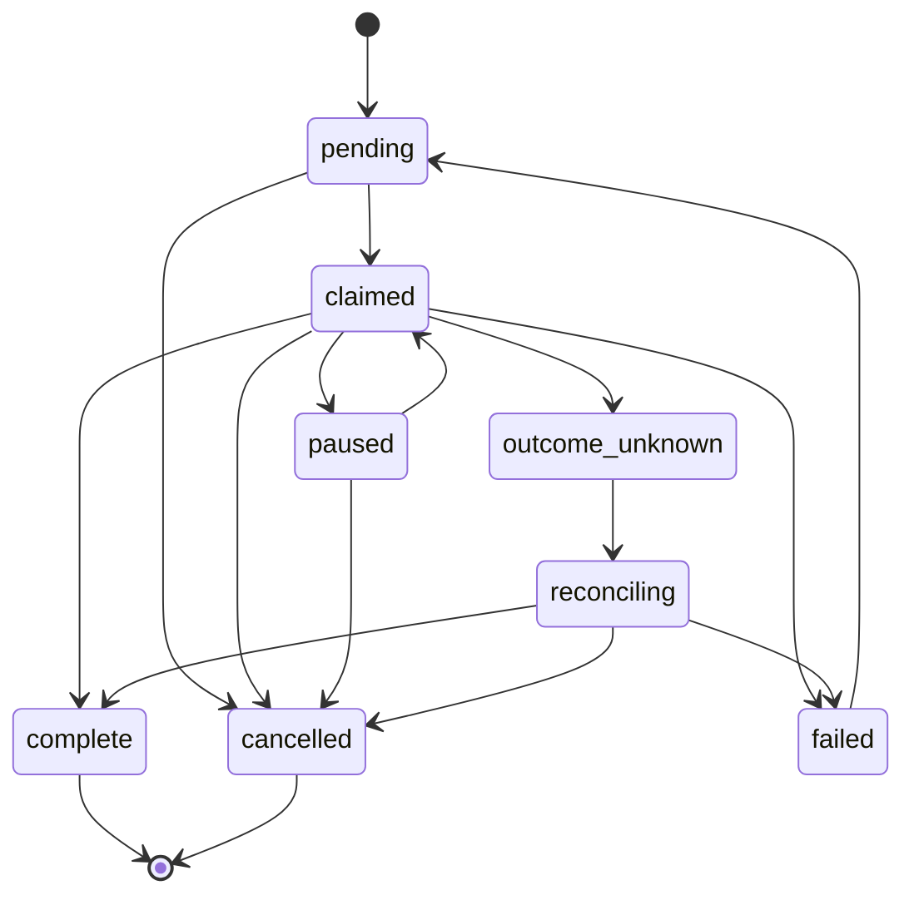

# Domain concepts and work lifecycle

**Audience:** operators, contributors, and agents who need to reason about
authoritative state before mutating anything.

**Scope labels used in this doc:**

| Label | Meaning |
|-------|---------|
| **Kernel** | `flowctl` + SQLite via application services (no R4 Compose required) |
| **Local candidate** | Full tree + `pytest` / local scripts on a developer machine |
| **Live acceptance** | Persistent Compose stack + `scripts/orchestrator_live_acceptance.py` and related ladders |
| **Production / VPS** | Not claimed by this repository; overlay env examples exist under `deploy/` only |

**Source anchors:** `src/flow_engine/domain/`, `src/flow_engine/application/`,
`src/flow_engine/persistence/migrations/`.

---

## Namespaces and core entities

| Concept | Role | Primary source |
|---------|------|----------------|
| **Project** | Namespace for queues, work, resources | `application/project_service.py`, migration `001_initial_schema.sql` |
| **Queue** | Ordered work intake | `application/queue_service.py` |
| **Work item** | Claimable unit with revision, dependencies, gates | `application/work_service.py`, `domain/states.py` |
| **Resource lease** | Temporal claim on a named resource (`advisory` or `strict`) | `application/resource_service.py` |
| **Gate** | Completion control (`required` / `optional`) with auditable waiver path | `application/gate_service.py` |
| **Finding** | Generic defect record with amendment history | `application/finding_service.py` |
| **Artifact / policy** | Metadata pointers and versioned policy references | `application/artifact_service.py`, `application/policy_service.py` |
| **Event ledger** | Append-only audit stream | `application/event_service.py` |
| **Runtime run / attempt / invocation** | R2 governed execution chain | `application/runtime_service.py`, `docs/r2-runtime.md` |
| **Organization / assignment / delegation** | R3 hierarchy and dispatch pins | `application/organization_service.py`, `docs/r3-organization.md` |

---

## Work item lifecycle

Work items use optimistic concurrency via **revision**. Claim, complete, fail,
and retry operations accept an optional `--revision` to detect stale writers.

### Status enum

From `domain/states.py` → `WorkItemStatus`:

`pending` · `claimed` · `paused` · `cancelled` · `complete` · `failed` ·
`outcome_unknown` · `reconciling`

Legacy four-state compatibility (`pending|claimed|complete|failed`) is preserved
for migration checks (`LEGACY_WORK_ITEM_STATUSES`).

### Allowed transitions

From `domain/transitions.py` → `WORK_ITEM_TRANSITIONS`:



Invalid transitions raise `InvalidTransitionError` (CLI exit **2**).

### Dependencies

`flowctl work submit --depends-on <work_id>` records dependencies at submit time.
Completion paths enforce dependency satisfaction in the work service (kernel).

### Idempotency

Most mutating CLI paths accept `--idempotency-key`. Duplicate keys with the same
payload replay the prior result instead of double-applying (`application/idempotency.py`).

---

## Gates, waivers, and fail-closed completion

| Gate status | Meaning (`GateStatus`) |
|-------------|------------------------|
| `open` | Not yet satisfied |
| `passed` | Satisfied normally |
| `failed` | Explicitly failed |
| `waived` | Auditable exception path |

**Required gates block work completion.** Waivers are never silent:

```bash
flowctl gate waive <gate_id> \
  --authority <who> \
  --reason <why> \
  --evidence-artifact-id <artifact_id>
```

Source: `cli/app.py` (`gate waive` requires all three evidence fields).

R2 founder step-up waivers (`runtime.waive_gate`) are founder-only and cannot
be issued from MCP or schedule surfaces (`control_plane/authz_matrix.py`).

---

## Findings and evidence

### Finding lifecycle

`FindingStatus`: `open` → `triaged` → `resolved` | `accepted`, with `reopened`
branches (`FINDING_TRANSITIONS` in `domain/transitions.py`).

### Anomaly taxonomy

`AnomalyCode` (`domain/states.py`):

| Code | Class |
|------|-------|
| A0 | Integrity / security |
| A1 | Uncertain side effect |
| A2 | Authority / scope / gate |
| A3 | Runtime / resource |
| A4 | Evidence / report |
| A5 | Quality / maintenance |

Schedules and script results validate against typed evidence schemas with byte
caps and secret redaction (`docs/r4-control-plane.md`, `script_sandbox/`).

---

## R2 runtime lifecycle (governed runs)

Runs, attempts, and invocations mirror the work-item pattern with additional
provider states. See [`r2-runtime.md`](../r2-runtime.md) and
[`architecture-and-execution.md`](architecture-and-execution.md).

**Fail-closed invariants (local candidate, enforced in coordinator):**

1. All authoritative R2/R3/R4 mutations enter `StateCoordinator.accept`.
2. Credit **reserve before dispatch**; terminal or `outcome_unknown` **settles**
   (consumes) the reservation (`domain/credits.py`, `application/credit_service.py`).
3. **No automatic paid retry** after `outcome_unknown` without founder step-up
   (`runtime.new_attempt_after_unknown`).
4. `SystemTestGrant` denies org/loadout fields on the compatibility path.
5. Unknown coordinator commands deny non-founder principals by default
   (`authz_matrix.py`).

---

## Credits and concurrency envelopes

Constants in `domain/credits.py` (acceptance defaults):

| Envelope | Value |
|----------|-------|
| Global provider concurrency | 3 |
| Per-provider concurrency | 1 |
| Per-project concurrency | 3 |
| Per-run concurrency | 2 |
| Per-attempt provider calls | 1 |
| Acceptance credit total / per provider | 9 / 3 |
| Heartbeat / inactivity / hard attempt timeout | 60s / 5m / 30m |

`--budget-scope-id` on every `flowctl runtime` command names a **stable campaign
scope**. Minting a new scope per work item defines a different campaign and must
not be used to evade budget (`cli/runtime_cmds.py` help text).

---

## Surfaces and principal roles

`Surface` enum: `cli`, `rest`, `mcp`, `worker`, `schedule`, `test`.

`PrincipalRole` enum: `founder`, `worker`, `executive`, `manager`, `system`.

Surface allowlists and command matrices are enforced server-side for REST and
coordinator HTTP (`control_plane/authz_matrix.py`). MCP and schedule surfaces
cannot issue founder step-up or recovery commands unless an explicit capability
widens the matrix.

---

## What is *not* authoritative

| Store | Role |
|-------|------|
| Redis | Celery broker only; non-authoritative |
| `.tmp/local-stack/manifest.json` | Local cache seeded by coordinator; not cross-slice source of truth |
| R1 catalogs (`agentic/catalogs/`) | Inert discovery contracts; not runtime enforcement |

The **work record's `work_item_id`** in coordinator SQLite is authoritative for
governed dispatch. Concurrent local slices must use distinct
`ORCH_LOCAL_STACK_MANIFEST` paths (`docs/read-the-docs.md`).

---

## CLI quick reference (kernel work path)

Validated against `flowctl work --help` on this branch:

```bash
flowctl work submit --queue <name> [--payload '{}'] [--depends-on <id>]
flowctl work list [--queue <name>] [--status <status>]
flowctl work show <work_id>
flowctl work claim [<work_id>] [--queue <name>] [--revision N]
flowctl work complete <work_id> [--revision N]
flowctl work fail <work_id> [--reason <text>] [--revision N]
flowctl work retry <work_id> [--revision N]
```

---

## See also

- [Architecture and execution paths](architecture-and-execution.md)
- [Auth and security](auth-and-security.md)
- [Operator runbook](operator-runbook.md)
- [Surface reference](../reference/surfaces.md)
- [Glossary](../reference/glossary.md)
