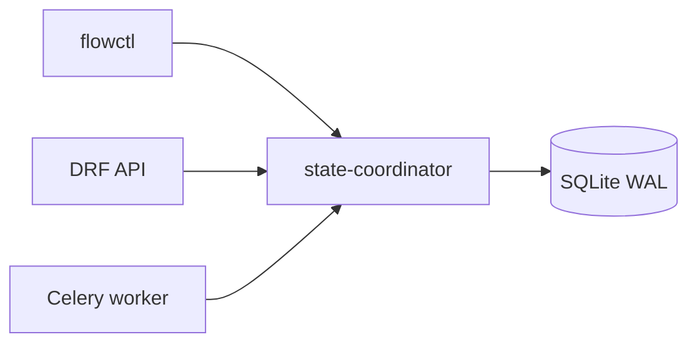

# Read the docs — Orchestrator

**Mandatory entrypoint.** Start here whether you are a new operator, contributor, or
agent. This page routes you through a learning path and points to source-grounded
deep guides — not a substitute for reading them when your task touches auth,
providers, or the control plane.

**Status:** Generic AGPL **local candidate** — active-test and `pytest` evidence
only. Passing tests or local acceptance does **not** assert production readiness or
close external governance gates.

---

## What Orchestrator is (30 seconds)

- SQLite-backed workflow kernel (`flow_engine` package; distribution `orchestrator`)
- Work items, queues, leases, gates, findings, R2 runtime, R3 org/delegation
- CLI (`flowctl`), optional read-only stdio MCP (`flowctl-mcp`)
- R4 **local** control plane: DRF API, coordinator sole-writer, Redis/Celery mock
  delivery, six MCP lanes, script sandbox, schedules, Compose harness

**Not:** a product adapter, hosted SaaS, or production-hardened deployment by
publication alone.

---

## Learning paths

Choose one path, then cross-link as needed.

### Path A — Operator (run something today)

1. [Operator runbook](guides/operator-runbook.md) — minimal kernel → persistent Compose → acceptance ladder
2. [Auth and security](guides/auth-and-security.md) — login, tokens, ops summary auth
3. [Troubleshooting](guides/troubleshooting.md) — symptom index

### Path B — Contributor (change code safely)

1. [`AGENTS.md`](../AGENTS.md) — non-negotiables
2. [Developer guide](guides/developer-guide.md) — repo map, tests, migrations, CPPRD
3. [Architecture and execution paths](guides/architecture-and-execution.md) — coordinator, DRF, workers
4. [Domain and lifecycle](guides/domain-and-lifecycle.md) — states, gates, credits

### Path C — Agent (observe vs mutate)

| Intent | Use | Avoid |
|--------|-----|-------|
| Repo / work / CI status | `flowctl-mcp` or `flowctl cap` | Mutating MCP for dispatch |
| Runtime / org / recovery | `flowctl runtime` / `org` / `delegation` or authenticated DRF | Direct SQLite while Compose is up |
| Ops dashboard data | `GET /ops/summary/` **with bearer** | Anonymous ops summary (403 when auth on) |
| Governance claims | Verify live gate register in **your** installation policy repo | Claiming gate closure from `pytest` alone |

---

## Deep guide index

| # | Topic | Document |
|---|--------|----------|
| 1 | Domain, lifecycle, gates, credits, fail-closed invariants | [guides/domain-and-lifecycle.md](guides/domain-and-lifecycle.md) |
| 2 | Architecture, coordinator, DRF, workers, trust boundaries | [guides/architecture-and-execution.md](guides/architecture-and-execution.md) |
| 3 | Human auth, principals, anonymous allowlist, threat model | [guides/auth-and-security.md](guides/auth-and-security.md) |
| 4 | Providers, host runner, acceptance, credit settlement | [guides/providers.md](guides/providers.md) |
| 5 | Operator runbook (kernel, Compose, acceptance, shutdown) | [guides/operator-runbook.md](guides/operator-runbook.md) |
| 6 | Developer guide (extensions, tests, CI, debugging) | [guides/developer-guide.md](guides/developer-guide.md) |
| 7 | Troubleshooting by symptom | [guides/troubleshooting.md](guides/troubleshooting.md) |
| 8 | API / CLI / MCP reference + glossary | [reference/surfaces.md](reference/surfaces.md), [reference/glossary.md](reference/glossary.md) |

---

## Layer docs (R1–R4)

Read in order when implementing a slice. Higher layers assume lower invariants.

| Layer | Document | In-tree |
|-------|----------|---------|
| R1 | [r1-assets.md](r1-assets.md) | `agentic/catalogs/` (inert) |
| R2 | [r2-runtime.md](r2-runtime.md) | Coordinator + `flowctl runtime` |
| R3 | [r3-organization.md](r3-organization.md) | `flowctl org` / `delegation` |
| R4 | [r4-control-plane.md](r4-control-plane.md) | Compose, DRF, MCP lanes |

Compact diagram: [architecture.md](architecture.md).

---

## Five-minute local start

### Minimal kernel

```bash
cd /path/to/Orchestrator
python3 -m venv .venv && source .venv/bin/activate
pip install -e '.[dev]'
pytest -q
flowctl init
flowctl status
```

### Persistent control plane (daily use)

```bash
pip install -e '.[control-plane,dev]'
bash scripts/local_stack_up.sh
python3 scripts/local_stack_sync_tokens.py
flowctl auth login --api-url http://127.0.0.1:8000
python3 scripts/orchestrator_live_acceptance.py
```

| Endpoint | URL | Auth |
|----------|-----|------|
| API | `http://127.0.0.1:8000` | Bearer for mutations |
| Health | `http://127.0.0.1:8000/health/` | None |
| Ops summary | `http://127.0.0.1:8000/ops/summary/` | Founder or `ops.read` |
| Coordinator | internal `:9001` | Not on host network |

**Concurrent slices:** set distinct `ORCH_LOCAL_STACK_MANIFEST` per parallel process;
default `.tmp/local-stack/manifest.json` is single-operator sequential only.

**Work-item creation:** interim path is coordinator seed (`scripts/r4d_seed_work.py`
via `local_stack_helpers.refresh_work_item`); authenticated work-submit API is deferred.

---

## Sole-writer rule (non-negotiable)

All authoritative mutations → `StateCoordinator.accept`. API, MCP lanes, and workers
call coordinator over authenticated HTTP. They do not open SQLite for writes.



Details: [architecture-and-execution.md](guides/architecture-and-execution.md).

---

## Installation boundary

| This repository | External (installation-local) |
|-----------------|------------------------------|
| Product runtime, Compose, `flow_engine`, public docs | Governance registers, private hooks, product adapters |

Coupling is via **installation-local** bridge tools and env configuration only.
Do not hardwire private paths or branding into `src/flow_engine/`.

---

## Skills and agentic catalogs

- [skills.md](skills.md) — repo-local skill bundles
- [`skills/`](../skills/) — packages
- [`agentic/manifest.json`](../agentic/manifest.json) — catalog index

---

## Verification and docs hygiene

```bash
pytest                                          # before verification claims
python3 docs/_audit/check_links.py              # relative link check
flowctl --help                                  # CLI drift check
```

Label partial test runs explicitly. Changelog: [CHANGELOG.md](../CHANGELOG.md).

---

## Suggested reading order (full)

1. This file
2. [`AGENTS.md`](../AGENTS.md)
3. [architecture.md](architecture.md)
4. Relevant **deep guide** from the index above for your task
5. Matching `r*.md` layer doc
6. Task-specific `skills/*/SKILL.md`
