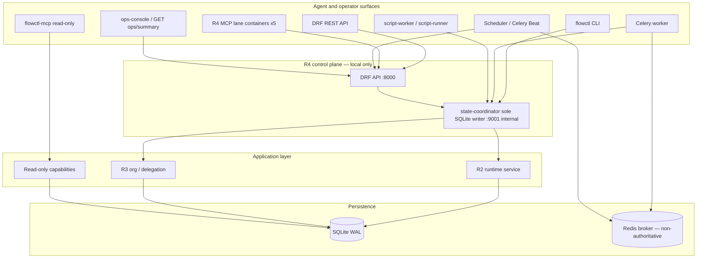

# Read the docs — Orchestrator onboarding

**Start here** if you are a human operator or an agent new to this repository.
This guide orients you to purpose, architecture, surfaces, local setup, and
boundaries before you touch code or claim verification.

**Status:** Generic AGPL candidate — local control-plane active-test only. Passing
tests and local evidence runs do **not** close Headquarters gates or assert
production readiness.

---

## What Orchestrator is

- A **generic SQLite-backed workflow orchestrator core** (`flow_engine` import
  package; distribution name `orchestrator`).
- **Work items, queues, resources/leases, gates/waivers, findings, artifacts,**
  and policy metadata with auditable history.
- **CLI** (`flowctl`) for kernel and runtime operations.
- **Layered runtime:** R1 inert catalogs → R2 governed runtime → R3
  organization/delegation → R4 local control plane (DRF API, coordinator,
  Redis/Celery mock delivery, MCP lanes, script sandbox, schedules).
- **Optional read-only MCP** (`flowctl-mcp`) over approved project capabilities.
- **Portable repo-local skills** under `skills/` (core, extended, positional bundles).

## What Orchestrator is not

- **Not** a product adapter for any specific business application.
- **Not** Headquarters governance, installation policy, or private product trees.
- **Not** a deployed SaaS or production-hosted control plane (R4 Compose is
  **local active-test only**).
- **Not** production-hardened by publication of this candidate alone.
- **Not** authorized to close governance gates (`G-ORCH-LOCAL-CONTROL-PLANE`,
  MVP/hosted gates, etc.) without independent review and operator evidence.
- **Real provider adapters** (Codex/Cursor/Claude production bindings) are out
  of scope unless separately authorized.

---

## Architecture



**Sole-writer rule:** All authoritative mutations enter through
`StateCoordinator.accept`. The DRF API, MCP lanes, and workers call the
coordinator over authenticated HTTP; they do not open SQLite for writes.

See [`architecture.md`](architecture.md) for the compact layer diagram and
security posture summary.

---

## R1–R4 layer map

| Layer | Scope | Doc | In-tree today |
|-------|--------|-----|----------------|
| **R1** | Inert versioned catalogs (assets, MCP lanes, loadouts, scripts, policy) — discovery only, not runtime activation | [`r1-assets.md`](r1-assets.md) | `agentic/catalogs/` |
| **R2** | Governed runs, attempts, credits, mock providers, recovery; `SystemTestGrant` compatibility path | [`r2-runtime.md`](r2-runtime.md) | Coordinator + `flowctl runtime …` |
| **R3** | Organization profiles, assignments, scoped delegation, resolved loadouts, dispatch pins | [`r3-organization.md`](r3-organization.md) | `flowctl org …`, `flowctl delegation …` |
| **R4** | Local control plane: DRF API (R4A), five MCP lanes (R4B), script sandbox + schedules (R4C), Compose active-test harness (R4D) | [`r4-control-plane.md`](r4-control-plane.md) | `docker/podman compose`, `scripts/r4d_active_test.sh` |

Read layer docs in order when implementing or reviewing a slice. Higher layers
assume lower-layer invariants (sole writer, fail-closed authz, no silent gate bypass).

---

## How agents operate

Agents interact with Orchestrator through **three primary channels**. Choose by
task mutability and surface policy.

### `flowctl` (CLI)

- **Use for:** Direct kernel operations, R2 runtime lifecycle, R3 org/delegation,
  recovery, founder step-up commands, local verification.
- **Writes through:** Coordinator (direct adapter or via local coordinator URL in
  control-plane mode).
- **Surface:** `cli` (and `test` in fixtures).
- **Examples:** `flowctl runtime create`, `flowctl org assign`, `flowctl runtime recover`.

### MCP (read-only stdio + R4 lane MCP)

- **Use for:** **Read-only** project context — repo health, open PRs, CI status,
  work lookup, session brief (`flowctl-mcp` / five R4 lane containers).
- **Default:** Read-only; no founder step-up or paid retry surfaces.
- **R4 lanes:** Call DRF with dual identity (initiating principal + MCP service
  principal); never touch SQLite or providers directly.
- **Install:** `pip install -e '.[mcp]'` then `flowctl-mcp`.

### DRF REST API

- **Use for:** Service-bound mutations in the local control plane — runtime dispatch,
  delivery jobs, MCP lane invoke, script execute, schedule tick/complete.
- **Auth:** Bearer / `X-Orchestrator-Token`; server resolves principal, role, grant.
- **Surface:** `rest` (plus `worker`, `schedule` for Celery services).
- **Ops read:** `GET /ops/summary/` (merged observability for local ops console).

### Routing cheat sheet for agents

| Intent | Prefer | Avoid |
|--------|--------|-------|
| Status / work lookup / CI / PRs | MCP read tools or `GET /ops/summary/` | Mutating MCP for dispatch |
| Create run, org assign, recover | `flowctl` or authenticated DRF when in Compose stack | Direct SQLite |
| Mock provider delivery | DRF + worker path | Bypassing coordinator |
| Governance claims | Verify live gate/register in HQ, not chat memory | Claiming gate closure from pytest alone |

Headquarters installation routing (when present): prefer MCP read tools and
`/ops/summary/` for observation; use DRF/`flowctl` for runtime ops; never direct
SQLite from HQ hooks or product code.

---

## Surfaces cheat sheet

| Surface | Enum | Typical actor | Mutates authoritative state? |
|---------|------|---------------|------------------------------|
| CLI | `cli` | Operator, agent with grant | Yes (via coordinator) |
| REST API | `rest` | API clients, MCP lanes (via DRF) | Yes (via coordinator) |
| MCP stdio / lanes | `mcp` | IDE agents | Read-only (stdio); R4 lanes invoke DRF only |
| Worker | `worker` | Celery mock delivery | Yes (heartbeat, result, delivery) |
| Schedule | `schedule` | Celery Beat / scheduler token | Effects-only schedule completion |
| Test | `test` | pytest fixtures | Yes in test DB only |

Founder step-up operations (e.g. `runtime new-attempt`) require founder role +
evidence on **CLI**; MCP and schedule surfaces cannot issue them.

Principal bootstrap is **off by default** (`ORCH_BOOTSTRAP_PRINCIPALS=0`).
Compose injects ephemeral tokens when enabled — never commit secrets.

---

## Local quickstart

### Minimal (kernel + CLI)

```bash
cd /path/to/Orchestrator
python3 -m venv .venv
source .venv/bin/activate
pip install -e '.[dev]'
pytest                    # verify before claims
flowctl --help
```

Override DB path when needed: `FLOW_DB_PATH`.

### Optional read-only MCP

```bash
pip install -e '.[mcp]'
export FLOW_PROJECTS_CONFIG=/path/to/projects.json   # optional; see architecture.md
flowctl-mcp
```

### R4 local control plane (active-test)

```bash
pip install -e '.[control-plane,dev]'
bash scripts/r4d_active_test.sh    # one-shot evidence harness (tears down by default)
```

### Persistent local stack (daily agent use)

```bash
bash scripts/local_stack_up.sh              # keeps running; writes .tmp/local-stack/manifest.json
python3 scripts/local_stack_sync_tokens.py  # if env rotated but coordinator volume retained
python3 scripts/orchestrator_live_acceptance.py   # full live API acceptance
python3 scripts/local_delegation_stress.py  # org seed + MCP delegation lifecycle
python3 scripts/local_stress_test.py        # L1/L2 + live acceptance + delegation + HQ bridge
```

Set `ORCH_HQ_ROOT=/home/pproctor/Headquarters` when HQ is not a sibling of the Orchestrator repo.

After Compose is up:

- API: `http://127.0.0.1:8000`
- Ops summary: `http://127.0.0.1:8000/ops/summary/` (`ORCH_SUMMARY_URL`)
- Coordinator: internal network only (port 9001 not published)

Run `pytest` before claiming verification. Label partial runs explicitly.

---

## Governance model

Orchestrator embeds **generic governance mechanics**; Headquarters owns
installation gates and reconciliation.

### In-engine controls

- **Gates and waivers** on work items — required gates block completion; waivers
  are auditable, not silent bypass.
- **Findings** with amendment history for material defects.
- **R2 credits and concurrency envelopes** — budget scopes shared across campaigns;
  no automatic paid retry without policy path.
- **R3 precedence and dispatch pins** — deny-wins, fail-closed hash mismatch,
  independent review separation.
- **R4 authz** — principal/role/grant resolved server-side; surface allowlists per
  principal kind.

### Agent non-negotiables (this repo)

See [`AGENTS.md`](../AGENTS.md): no secrets, no private absolute paths in tracked
files, no product adapter creep, trust-but-verify before merge/release claims,
tests before verification claims, CPPRD for material changes.

### Gates (Headquarters — verify live)

Do **not** treat local pytest or R4D evidence as gate closure. Verify live state in
Headquarters `gate-register.md` and reconciled docket before claiming dependent
work is authorized. Silence and agent consensus never close a required gate.

---

## Installation boundary (Headquarters ↔ Orchestrator)

| Repo | Owns | Does not own |
|------|------|--------------|
| **Orchestrator** (this repo) | Product runtime, Compose stack, flow_engine, generic docs/skills | HQ governance docs, installation hooks, private product adapters |
| **Headquarters** | Governance, programs, ops, `bin/hq-*`, Cursor hooks | Orchestrator SQLite, product runtime internals |

**Coupling rule:** HQ ↔ Orchestrator via **installation-local hooks and bin tools
only** (`hq-orch-bridge`, `hq-delegate`, session hooks). **Do not** hardwire
Headquarters tools or private paths into public Orchestrator product code.

Hooks are installation-local; they are not imported into the Orchestrator package.
Product code stays generic and portable.

---

## Further reading index

| Topic | Location |
|-------|----------|
| Repository rules for agents | [`AGENTS.md`](../AGENTS.md) |
| Layer diagram and core concepts | [`architecture.md`](architecture.md) |
| R1 inert catalogs | [`r1-assets.md`](r1-assets.md) |
| R2 runtime / coordinator | [`r2-runtime.md`](r2-runtime.md) |
| R3 org / delegation | [`r3-organization.md`](r3-organization.md) |
| R4 control plane / Compose / API | [`r4-control-plane.md`](r4-control-plane.md) |
| Skills discovery and bundles | [`skills.md`](skills.md) |
| Repo-local skill packages | [`../skills/`](../skills/) |
| Agentic manifest / catalogs | [`../agentic/manifest.json`](../agentic/manifest.json) |
| R4D active-test script | [`../scripts/r4d_active_test.sh`](../scripts/r4d_active_test.sh) |
| Headquarters bootstrap (installation) | `~/Headquarters/AGENTS.md` (when working across repos) |
| HQ Orchestrator program / gates | `~/Headquarters/programs/orchestrator-platform/` |

**Suggested reading order:** this file → [`AGENTS.md`](../AGENTS.md) →
[`architecture.md`](architecture.md) → relevant `r*.md` for your slice →
task-specific `skills/*/SKILL.md`.
